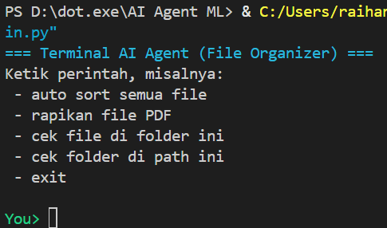

# Terminal AI Agent – File Organizer

Proyek ini adalah **Terminal AI Agent** yang dapat memahami perintah bahasa natural untuk merapikan file di dalam folder secara otomatis.  
Fitur utama meliputi:
- ⭐ Auto Sort File berdasarkan kategori  
- ⭐ Auto Rename dengan format rapi  
- ⭐ Organizer file PDF  
- ⭐ Cek file dan folder  
- ⭐ Terminal dengan styling warna

---

## 📸 Screenshot Terminal

> *Contoh tampilan interface berwarna: Hijau untuk input user, Kuning untuk proses AI Thinking, dan Cyan untuk output agent.*

---

## 🚀 Fitur Utama

### 🗂 1. Auto Sort + Auto Rename  
Mengelompokkan file ke folder seperti:
`Music`, `Videos`, `Images`, `Documents`, `Archives`, `Others`

Contoh rename otomatis:
Documents_0001.pdf
Images_0003.png
Music_0002.mp3

### 📑 2. Smart PDF Organizer  
Memindahkan seluruh `.pdf` ke folder `Organized/`  
Dengan auto-rename jika nama file bentrok.

### 🔍 3. Cek File  
Menampilkan daftar file di folder aktif.

### 📁 4. Cek Folder  
Menampilkan folder yang ada dalam direktori.

### 🎨 5. Terminal Interface Berwarna  
- Hijau → Input User  
- Kuning → AI Thinking  
- Cyan → Output Agent  

---

## 🛠️ Instalasi & Cara Menjalankan

### 1. Pastikan Python terinstall  
Cek versi:
python --version

### 2. Clone repository

git clone <url-repo-anda>

### 3. Masuk ke folder project

cd AI-Agent-File-Organizer

### 4. Jalankan aplikasi

python main.py

---

## 💬 Contoh Perintah

| Perintah | Fungsi |
|---------|--------|
| `auto sort semua file` | Menjalankan auto-sort dan auto-rename |
| `rapikan file pdf` | Memindahkan seluruh PDF ke folder Organized |
| `cek file` | Menampilkan daftar file |
| `cek folder` | Menampilkan daftar folder |
| `exit` | Keluar dari aplikasi |

---

## 📂 Struktur Folder

project/
│── main.py
│── tools.py
│── screenshot_terminal.png
│── README.md

---

## 🛡️ Keamanan Sistem
Program ini **tidak akan memindahkan** file berikut:
- main.py  
- tools.py  
- `.git/`  
- `__pycache__/`  
- folder kategori (Music, Videos, etc.)  

Supaya program tidak mengacak file penting.

---

## 🙌 Kontribusi
Silakan submit Issue atau Pull Request jika ingin memperbaiki fitur atau menambah kemampuan baru.
